<p align="center">
  
</p>

<p align="center">
  
  
  
  
  
</p>

<p align="center">
  <i>Frontier image models score >90% on standard benchmarks, but fail catastrophically on compositional prompts.<br/>This pipeline measures exactly where they break.</i>
</p>

<p align="center">
  <a href="#-results">Results</a>&nbsp;&nbsp;|&nbsp;&nbsp;<a href="#-how-it-works">How It Works</a>&nbsp;&nbsp;|&nbsp;&nbsp;<a href="#-quick-start">Quick Start</a>&nbsp;&nbsp;|&nbsp;&nbsp;<a href="#-dashboard">Dashboard</a>&nbsp;&nbsp;|&nbsp;&nbsp;<a href="#-architecture">Architecture</a>
</p>

<br/>


<br/>

##  Results

Evaluated on **50 hard adversarial prompts** (L3) for T2I and **24 hard prompts** for editing — testing attribute binding, counting, negation, spatial reasoning, causal physics, and rare combinations.

### Text-to-Image Generation

<p align="center">
  
</p>

> **Key finding**: Aurora leads on hard compositional prompts with **0.82 GM** across 50 prompts (95% CI: 0.78–0.86). All models maintain >0.90 AM — the gap between AM and GM reveals that models fail *completely* on specific atoms rather than performing poorly across the board. FLUX 2 Max filtered 27% of adversarial prompts via content moderation. Confidence intervals are bootstrap-resampled over prompts (10k iterations).

### Image Editing

<p align="center">
  
</p>

> **Key finding**: No model excels at all three dimensions simultaneously. Flux2 Flex leads on instruction following but struggles with visual consistency. Picsart preserves consistency but cannot follow edit instructions — a fundamental tension in current editing architectures. Rankings are directional — overlapping CIs at this sample size (24 prompts) mean differences between adjacent models may not be significant.

<br/>


<br/>

##  How It Works

<p align="center">
  
</p>

### Soft-TIFA Scoring

Based on [GenEval 2](https://arxiv.org/abs/2512.16853) (Kamath et al., Dec 2025):

```
1. Decompose prompt  ───>  "A red car next to a blue house"
                            ├── "Is there a car?"
                            ├── "Is the car red?"
                            ├── "Is there a house?"
                            ├── "Is the house blue?"
                            └── "Is the car next to the house?"

2. Judge each atom   ───>  MLLM extracts P(Yes) from logprobs

3. Aggregate         ───>  AM = mean(pᵢ)          ← partial credit
                            GM = exp(mean(log pᵢ)) ← strict (one miss collapses)
```

> **Why GM?** AM gives partial credit — a prompt with 4/5 atoms at 0.95 and 1 at 0.10 scores **0.78**. GM scores it **0.53**. GM correlates better with human judgment (AUROC 94.5% vs 91.6% for legacy TIFA).

### Edit Evaluation — 3-Axis Scoring

| Dimension | What It Measures |
|:----------|:-----------------|
| **Instruction Following** | Did the requested edit actually happen? |
| **Visual Consistency** | Are unedited regions preserved? |
| **Detail Preservation** | Are fine details (text, textures) intact? |

<br/>


<br/>

##  Quick Start

```bash
git clone git@github.com:iamaniket0/visual-eval-.git
cd visual-eval-
python -m venv .venv && source .venv/bin/activate
pip install -e ".[dev]"

# Configure API keys
cp .env.example .env
```

### Run T2I Evaluation

```bash
visual-eval t2i prompts                     # Build prompt set
visual-eval t2i generate --models full      # Generate images
visual-eval t2i judge                       # MLLM judge
visual-eval t2i aggregate                   # Leaderboard
visual-eval t2i report                      # PDF scorecards
```

### Run Edit Evaluation

```bash
visual-eval edit download-images            # Get source images
visual-eval edit run --models full          # Run edits
visual-eval edit judge                      # 3-axis judge
visual-eval edit aggregate                  # Aggregate scores
```

### Docker

```bash
docker compose up dashboard                 # Launch dashboard
docker compose --profile cli run pipeline t2i generate --models sanity
```

<br/>


<br/>

##  Dashboard

Interactive Streamlit dashboard for exploring results:

```bash
visual-eval dashboard
```

<table>
<tr>
<td width="50%">

**T2I Analysis**
- Ranked bar chart + data table (GM/AM)
- Sub-category breakdown (radar + grouped bars)
- Layer comparison (L1 vs L2 vs L3)
- Theme score heatmap

</td>
<td width="50%">

**Edit Analysis**
- Ranked leaderboard with dimension heatmap
- Per-subcategory breakdowns
- Cross-pipeline comparison (box plots)
- Model-vs-model drill-down

</td>
</tr>
</table>

<br/>


<br/>

##  Models Supported

<table>
<tr>
<td width="50%">

### T2I Generation

| Model | Provider |
|:------|:---------|
| Aurora | xAI |
| GPT Image 2 | OpenAI |
| GPT Image 1.5 | OpenAI |
| FLUX 2 Max | BFL |
| FLUX 1.1 Pro Ultra | BFL |
| Bria 2.3 | Bria AI |
| Stable Diffusion 3.5 | Stability AI |
| Firefly Image 3 | Adobe |
| Imagen 3 | Google |

</td>
<td width="50%">

### Image Editing

| Model | Provider |
|:------|:---------|
| Flux Kontext | BFL |
| Flux2 Flex | BFL |
| Bria Edit | Bria AI |
| Picsart | Picsart |
| Firefly Edit | Adobe |
| PhotoRoom | PhotoRoom |

</td>
</tr>
</table>

<br/>


<br/>

##  Architecture

```
visual-eval/
├── src/
│   ├── core/                        # Scoring math, CostTracker, JSONL I/O
│   ├── t2i/                         # Text-to-Image evaluation
│   │   ├── generators/              # Model adapters (@register pattern)
│   │   ├── judge.py                 # MLLM judge (Soft-TIFA)
│   │   ├── aggregator.py            # Per-model/category/theme scoring
│   │   ├── report.py                # PDF scorecards + charts
│   │   └── hitl.py                  # Human-in-the-loop validation
│   └── edit/                        # Image Editing evaluation
│       ├── editors/                 # Editor adapters (@register pattern)
│       ├── judge.py                 # Dual-image judge (source + edited)
│       └── aggregator.py            # 3-axis dimension scoring
├── config/                          # Model configs + pipeline settings
├── scripts/                         # CLI pipeline scripts
├── prompts/                         # T2I (L1+L2+L3) + Edit prompts
├── dashboard/                       # Streamlit interactive dashboard
└── tests/                           # 51 tests (scoring, generators, judge, aggregator)
```

<details>
<summary><strong>Key Design Decisions</strong></summary>

| Decision | Rationale |
|:---------|:----------|
| **Atomic binary decomposition** | Multi-step rubric judgments cause MLLMs to hallucinate failures |
| **GM as primary metric** | Collapses on single weak atom, 94.5% AUROC with human judgment |
| **FILTERED != retried** | Content-policy blocks scored 0 — preserves benchmark integrity |
| **Hard cost cap** | CostTracker with 80% alert threshold and hard cutoff |
| **Resume-friendly** | Generation skips existing outputs, no wasted API calls |

</details>

<details>
<summary><strong>Output Structure</strong></summary>

```
outputs/
├── t2i/
│   ├── generations/{model}/{prompt_id}.png   # not tracked in git
│   ├── judgments/{model}.jsonl
│   ├── scores/  (leaderboard.csv, per_subcategory.csv, layer_comparison.csv)
│   └── reports/ (aggregate_report.pdf, {model}_card.pdf)
└── edit/
    ├── edits/{model}/{prompt_id}.png          # not tracked in git
    ├── judgments/{model}.jsonl
    └── scores/  (leaderboard.csv, per_dimension.csv, per_subcategory.csv)
```

> Generated images and metadata logs are excluded from git (reproducible via the pipeline). For a lightweight clone: `git clone --filter=blob:none`.

</details>

<details>
<summary><strong>Configuration</strong></summary>

```yaml
# config/t2i/settings.yaml
judge:
  backend: qwen_together_soft       # or gpt4o_soft
  model_slug: "Qwen/Qwen3.5-397B-A17B"
seeds_per_prompt: 1
cost:
  hard_cap_usd: 300

# config/edit/settings.yaml
dimensions:
  - instruction_following
  - visual_consistency
  - detail_preservation
```

</details>

<br/>


<br/>

##  Testing

```bash
pytest tests/ -v              # All 51 tests
visual-eval test              # Via CLI
```

| Suite | Tests | Coverage |
|:------|:------|:---------|
| `test_core/` | 14 | Scoring math, CostTracker |
| `test_t2i/` | 21 | Generators, judge, aggregator, prompt loader |
| `test_edit/` | 16 | Editors, judge, aggregator |

<br/>


<br/>

##  References

| Paper | Venue |
|:------|:------|
| [Soft-TIFA / GenEval 2](https://arxiv.org/abs/2512.16853) | Kamath et al., Dec 2025 |
| [T2I-CompBench++](https://github.com/Karine-Huang/T2I-CompBench) | NeurIPS 2023, TPAMI 2025 |
| [SpatialGenEval](https://arxiv.org/abs/2501.09652) | ICLR 2026 |
| [R2I-Bench](https://github.com/PLUM-Lab/R2I-Bench) | EMNLP 2025 |
| GEditBench v2 | NTU 2026 |
| [CompAlign / CompQuest](https://arxiv.org/abs/2505.11178) | 2025 |

<br/>

---

<p align="center">
  <sub>Built for evaluating frontier visual AI — where benchmarks saturate but compositional understanding doesn't.</sub>
</p>
