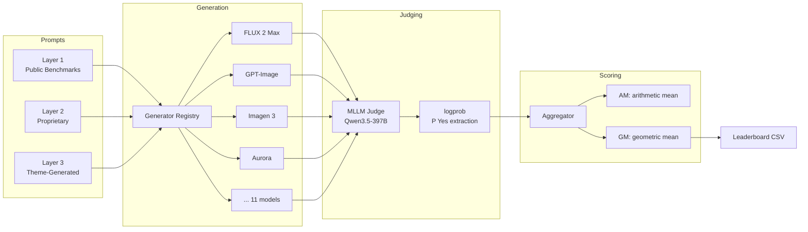
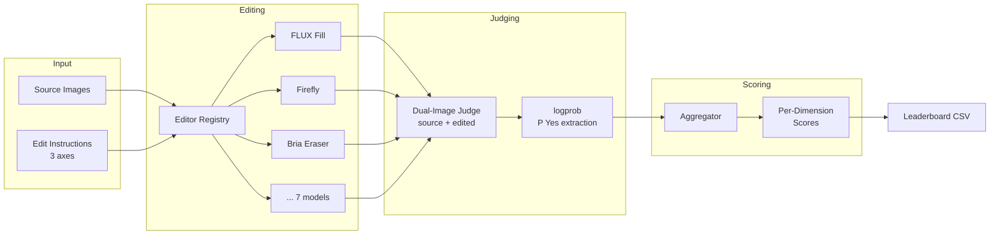
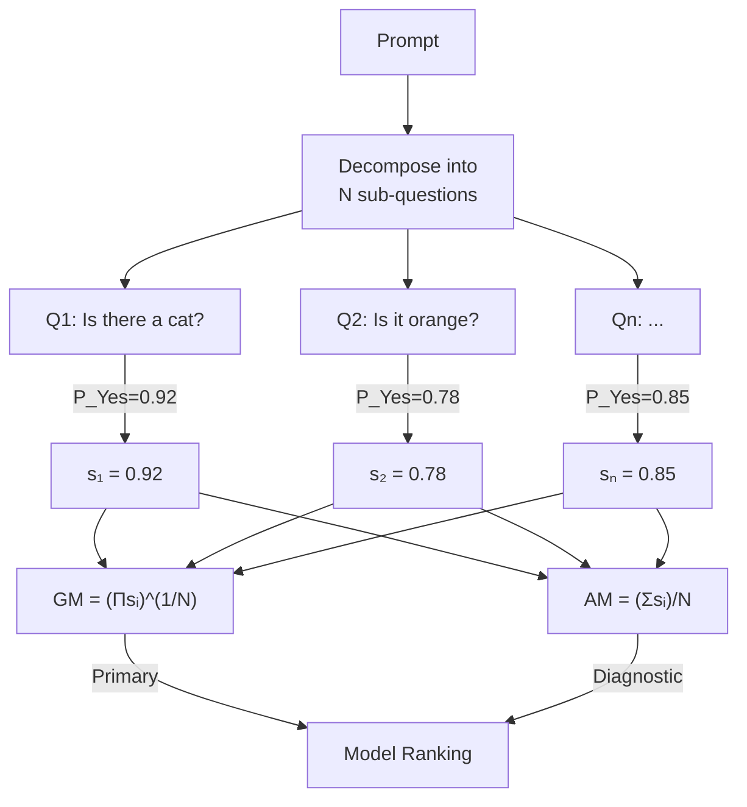

# Architecture

## T2I Evaluation Pipeline



## Edit Evaluation Pipeline



## Soft-TIFA Scoring



## System Architecture

```mermaid
graph TB
    subgraph CLI["CLI (typer)"]
        TC[visual-eval t2i ...]
        EC[visual-eval edit ...]
        DC[visual-eval dashboard]
    end

    subgraph Core["src/core/"]
        REG[Registry\n@register decorator]
        CT[CostTracker\nthread-safe, hard cap]
        JDG[Judge\nMLLM + logprob]
        UTL[Utils\nIO, retry, config]
    end

    subgraph T2I["src/t2i/"]
        TG[Generators\n11 adapters]
        TA[Aggregator]
        TR[Report]
        TP[Prompt Loader]
    end

    subgraph Edit["src/edit/"]
        EE[Editors\n7 adapters]
        EA[Aggregator]
        ER[Report]
    end

    subgraph Dashboard["dashboard/"]
        ST[Streamlit App]
        PL[Plotly Charts]
    end

    TC --> TG & TA & TR & TP
    EC --> EE & EA & ER
    DC --> ST --> PL

    TG & EE --> REG
    TG & EE --> CT
    TG & EE --> JDG
    TG & EE --> UTL
```
